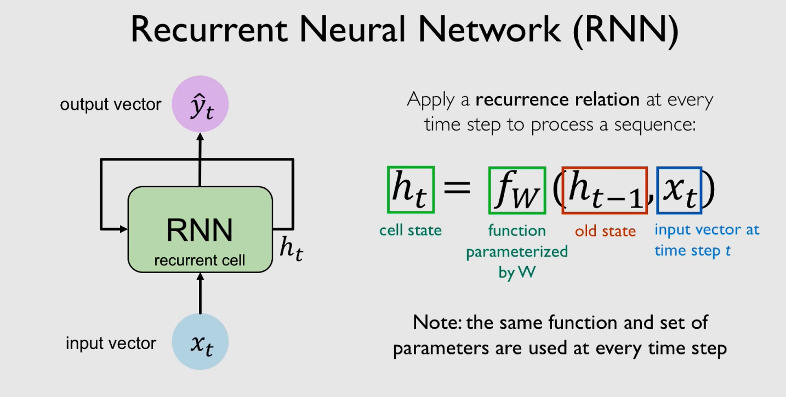
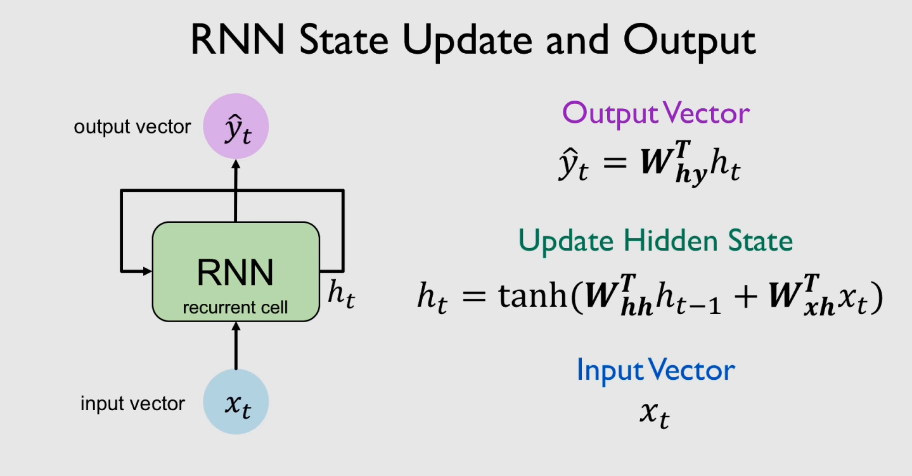
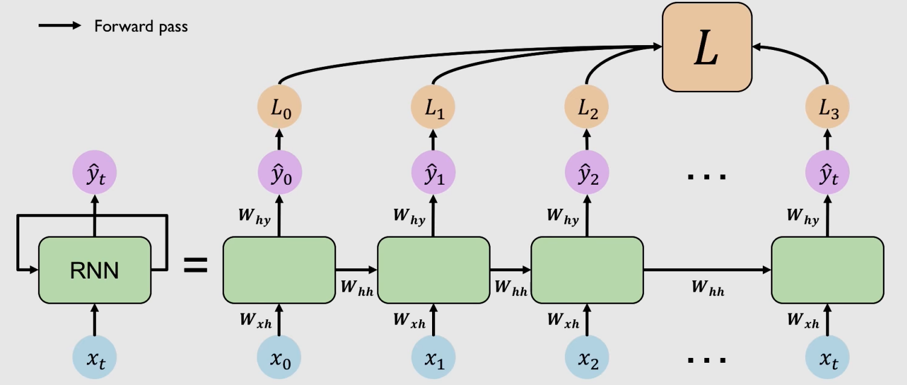
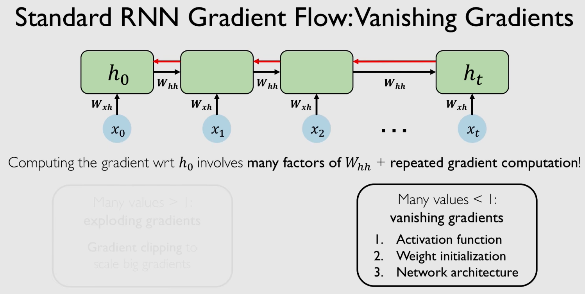
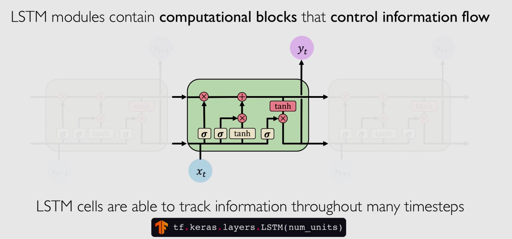

# RNN (recurrent neural networks)

## ::Sequence Modelling::

**Sequence modelling problem** : prediciting the next word in a sentence, how many inputs should we have for predicting the next word in a feed forward network.
To counter some solutions can be:-

1. Only use last two words. However we may not get correct predicitons since it may depend on a word not in the last two.
2. Using entire sequece and as set of couts (bag od words), we input the count of words over a vocabulary however using just the counts we lose all the sequential history of the sentence.
3. Use a large fixed window. however in a feed forward if say a sentence always began with a fixed word and may not be shared in the full network so in the case where this parameter was to appear later will confuse the model.

### Sequence modelling: Design Criteria
1. Handle variable-length sequences
2. Track long-term dependencies
3. Maintain nformation about order
4. Share parameters across the sequence

Hence RNN are an approach to sequence modelling problems.

## ::what is RNN::
Standard neural networs go in one directions and not able to hold sequential information. Rnn have loops.

### Training RNNs
## Backpropogation Through Time (BPTT)

Vanishing gradient problem: multiply small numbers together so our errors due to further time steps have smaller and smaller gradients.
As the gap in sequentially relevant bits of information grows standard RNN run into this isse of vanishing gradient problem.

### Trick 1: Activation functions
If we use ReLU prevents our value of derivation from shrinking as gradient is 1 when x >0
### Trick 2: Parameter initialization
Initialise weights to indentity matrix helps prevent them shrinking to 0 during backpropogation.
### Solution 3: Gated Cells
use more complex revurrent unit with gates to control what information is passed through.
eg. **Long Short Term Memory (LSTMs)** networks rely on a gated cell to track information throughout many time steps. Well suited to learning long term dependencies

## LSTM networks
in a standard RNN repreating modules contain simple computation node. A tanh layer for example output is func of h_(t-1) and x_t.

Key builidng block of a lstm is gate which enables to selectively add or remove states to this state. 
Information is added or removed through structures called gates.
Gates optionally let information through, for example via a sigmoid neural net later and pointwise multiplication.
Intuitively its how much information that has passed through the gate should be retained between nothing and everthing.

They process information through 4 different steps:
1. Forget : they first foret their irrelevant history
function of prior internal state and new input. Carry data that carries meaning.
2. Store : perform computation to store new relevant parts.
Decide relevant info and store it. 
3. Update : Use these two to selectively update their internal state
4. Output : generate an output. Via output gate which controles what information encoded in the sell state is sent as input into the next time state.

All of this different gating and mechanish help create such a cell state for uninterrupted gradient flow. This helps us alleviate vanishing gradient problem

### LSTM: Key Concepts:
1. Maintain a seperate cell state from what is outputted
2. Use gates to control the flow of information
3. Backpropogation through time with uninterrupted gradient flow

## RNN applications:
1. input: sheet music, output: next character in sheet music. This can make RNN predict music notes. The we can make a network such that it can generate brand new music.
2. Sentiment classification: input: sequence of words, output : emotion related to text
3. Machine translation: backbone of google translate. 
Encoder: encodes origional language to state vector and decoder: decodes into new language.
4. Trajectory prediction: self-driving cars
5. Environmental modelling

## To summarise
1. RNN are well suited for sequence modelling tasks
2. Model sequences via a recurrence relation
3. Training RNN with backpropogation in time
4. applications